# PolyArc CSG
[SolutionSketch](#SolutionSketch) ·
[Installation](#installation) ·
[Usage](#Usage) ·

**PolyArc CSG** enables *exact signed distance field (SDF) evaluation* for **arbitrary 2D CSG expressions** by converting them into **intersection-free boundary representations** composed of line segments and circular arcs (*PolyArcs*).

---

## Application 1: SDF evaluation

The following examples compare standard SDF evaluation against Resolved PolyArc-based evaluation for equivalent CSG programs.

<div align="center">

| **Code** | **Incorrect SDF** | **Correct SDF — PolyArc CSG** |
|:--:|:--:|:--:|
| <p align="center">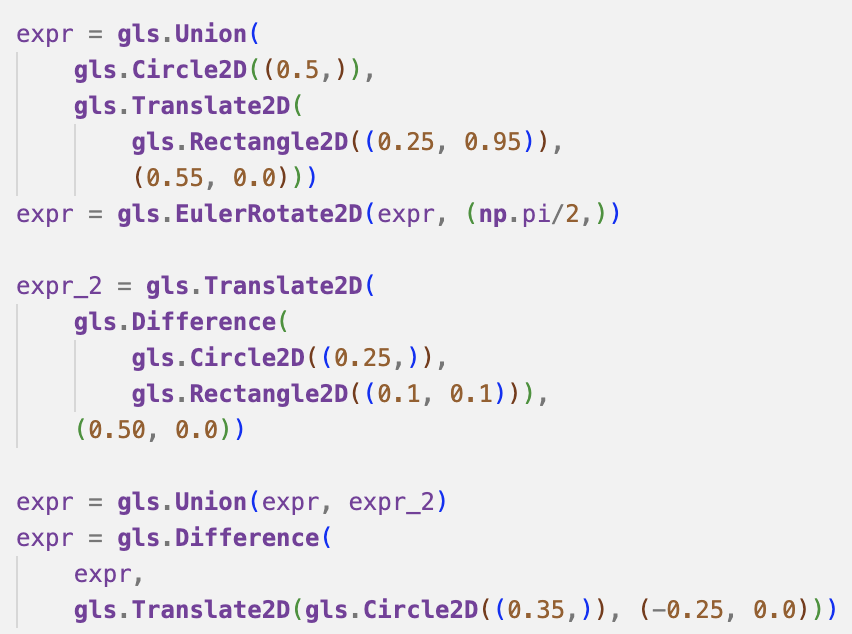</p> | <p align="center">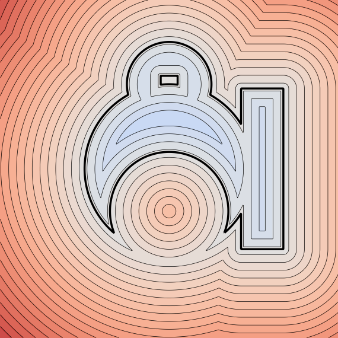</p> | <p align="center">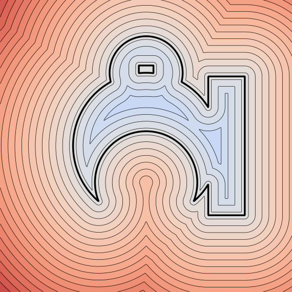</p> |
| <p align="center">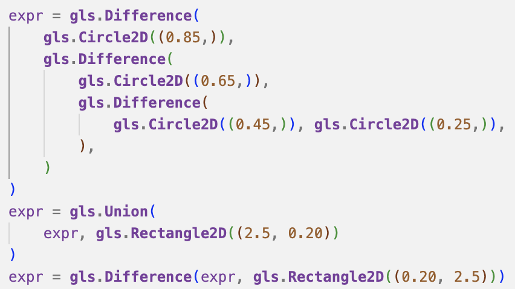</p> | <p align="center">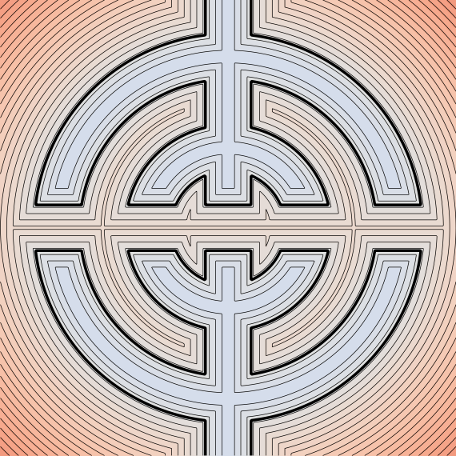</p> | <p align="center">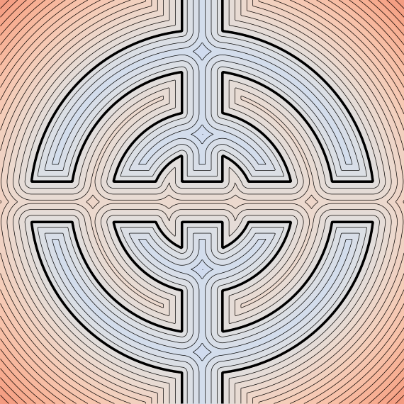</p> |
| <p align="center">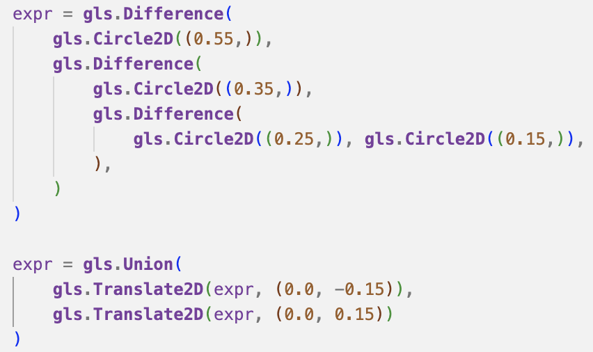</p> | <p align="center">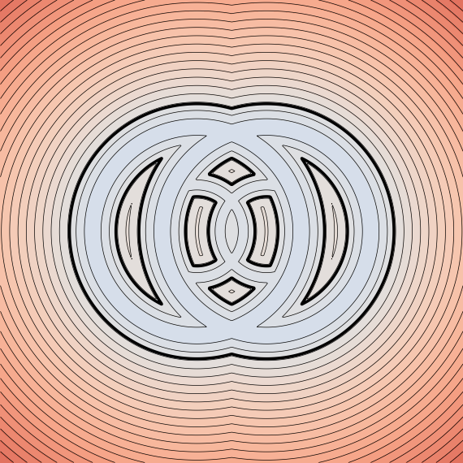</p> | <p align="center">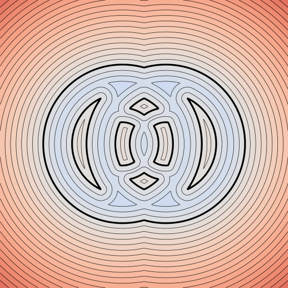</p> |

</div>

---

## Application 2: Morphological operations

Applying morphological operators on inexact SDF results in wrong outputs. Here we compare application of morphological operation on basic and resolved polyarc expressions.

### Base shape

<p align="center">
  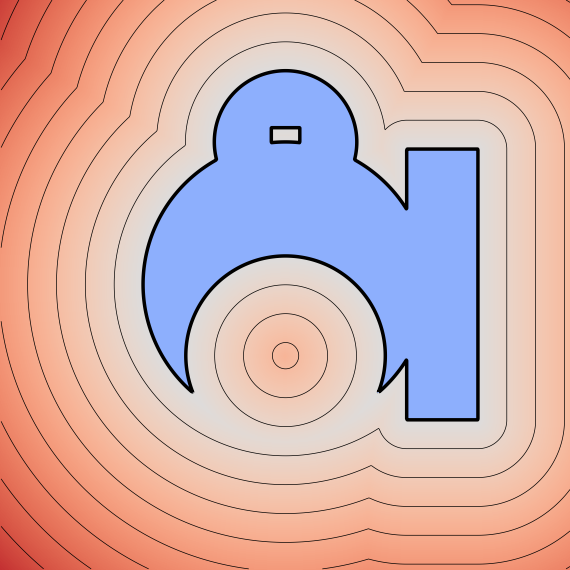
</p>

<div align="center">

| **Operation** | **Incorrect SDF** | **Correct SDF — PolyArc CSG** |
|:--|:--:|:--:|
| **Dilation** | <p align="center">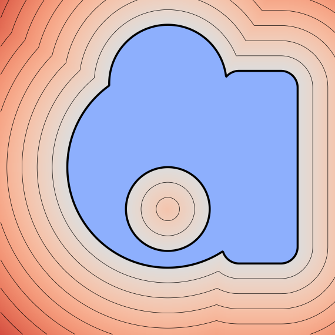</p> | <p align="center">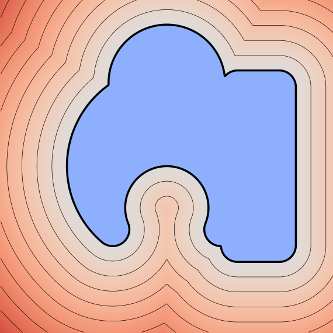</p> |
| **Erosion**  | <p align="center">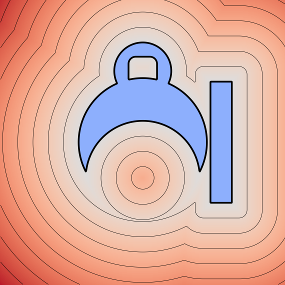</p> | <p align="center">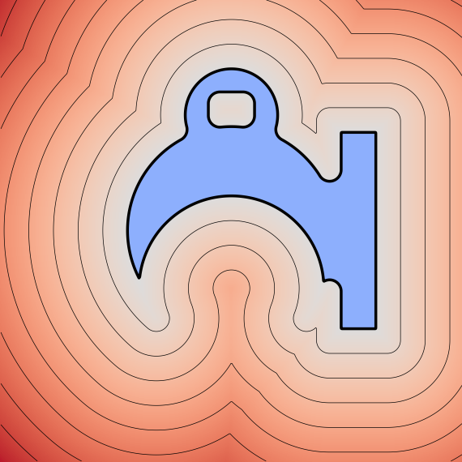</p> |

</div>
## Application 3: Extruded 3D Primitives

As noted by Inigo Quílez, a 3D shape with an **exact signed distance field** can be constructed by extruding a 2D shape whose SDF is itself exact. In this setting, correctness of the 3D SDF directly inherits from the correctness of the underlying 2D CSG formulation.

Exact SDFs in 3D offer several practical advantages:
1. **Stable sphere tracing**, resulting in sharper silhouettes and fewer shadow artifacts.
2. **Correct smooth Boolean operations**, whose behavior is highly sensitive to SDF accuracy (both in 2D and 3D).

The example below (created using [ASMBLR](https://github.com/BardOfCodes/asmblr) and [SySL](https://github.com/BardOfCodes/sysl)) illustrates these effects. When the 2D CSG is evaluated using PolyArc CSG, the resulting extruded 3D shape admits an exact SDF, leading to visibly improved rendering quality.

<div align="center">

| **CSG Code** | **Inexact 3D SDF** | **Exact 3D SDF — PolyArc CSG** |
|:--:|:--:|:--:|
| <p align="center">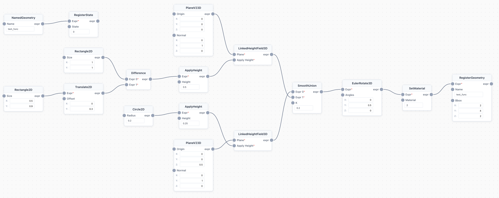</p> | <p align="center">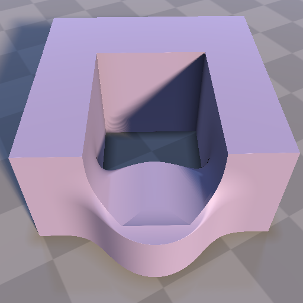</p> | <p align="center">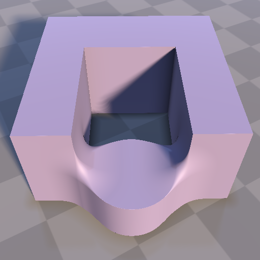</p> |

</div>

---

# The problem: inexact SDFs for 2D CSG formulas

In standard CSG pipelines, signed distance fields are evaluated using `min`/`max` pooling over primitive SDFs.  
While this construction is *correct for inside–outside tests*, it does **not** produce an *exact* SDF for general CSG expressions.

This inexactness causes practical failures:
- Gradients are incorrect away from zero-level sets, harming SDF-based optimization.
- Offset curves (parallel contours) are distorted or self-intersecting.
- Downstream operations such as medial-axis reasoning or fabrication-aware offsets become unreliable.

---

### Statement

Let \( F \) be a 2D CSG expression composed of primitives
\[
F = \mathcal{C}(P_1, P_2, \dots, P_n),
\]
where \( \mathcal{C} \) denotes a Boolean formula over union, intersection, and difference.

Assume that:

1. For each primitive \( P_i \), its signed distance function \( d_i(x) \) is known *exactly*.
2. The boundary curves of all primitives involved in \( F \), as well as those induced by Boolean composition, form a set of **non-intersecting curve segments**.

Then, the signed distance function of the shape represented by \( F \) is given exactly by the standard min/max composition of primitive SDFs sd dictated by the CSG formula.

Under these conditions, min/max pooling does not introduce spurious distance errors and yields the *exact* signed distance to the CSG shape.

This observation directly follows from **Idea 4** in Inigo Quílez’s article on [*“Interior Distance”*](https://iquilezles.org/articles/interiordistance/), which notes that min/max SDF composition is exact when the contributing boundaries do not intersect.

# SolutionSketch

## What is a PolySet?

A **PolySet** is a collection of closed **PolyArc** loops that together define a 2D region.

A PolySet may contain:
- Multiple disjoint outer boundaries
- Nested holes, represented by loops with alternating orientation
- Arbitrary enclosure hierarchies

For example, a donut is represented by two PolyArcs:
- An outer loop with positive orientation
- An inner loop with negative orientation (representing the hole)

The defining invariant of a PolySet is that **no PolyArc curves intersect**.

This invariant is critical: when it holds, the boundary of the region is well-defined and supports exact signed distance evaluation.

## From CSG expressions to PolySets

To enforce the above invariant in practice, this repository adopts the following strategy:

1. Convert each CSG primitive into an explicit boundary representation composed of line segments and circular arcs (**PolyArcs**).
2. Resolve all induced boundary intersections, producing a **PolySet** whose curves are guaranteed to be intersection-free.
3. Evaluate the signed distance function exactly using min/max composition of primitive SDFs, following the original CSG formula.


## Resolving intersecting PolyArcs

The central technical challenge is converting an *arbitrary* symbolic 2D CSG expression into an **intersection-free PolySet**.

Naively composing PolyArc boundaries under Boolean operations introduces curve–curve intersections. These intersections cannot be resolved locally, because CSG expressions impose a **hierarchical dependency structure**: boundaries originating from different subtrees of the expression tree may interact in nontrivial ways.

### Key idea

Rather than resolving intersections within a deeply nested CSG tree, the algorithm repeatedly transforms the expression into equivalent forms that **expose direct interactions between boundary curves**.

Specifically:
- Nested Boolean expressions are rewritten into **CNF** (conjunctive normal form) and **DNF** (disjunctive normal form).
- These normal forms flatten the hierarchy into shallow expressions where unions and intersections are explicit.
- Boundary intersections are detected and resolved at this flattened level.
- By interleaving CNF/DNF transformations with boundary resolution, the algorithm converges to a representation in which all curve interactions have been correctly handled.

The result is a **valid PolySet** whose PolyArc curves exactly describe the boundary of the CSG shape and do not intersect.

## Implementation

This logic is implemented in: [polyarc_csg/valid_polyset.py](polyarc_csg/valid_polyset.py).

The implementation:
- Parses symbolic CSG expressions (including transforms),
- Identifies and resolves boundary intersections induced by Boolean composition,
- Produces a PolySet that represents the exact geometric boundary.

Once this conversion is complete, **exact SDF evaluation becomes straightforward and robust**.

## Limitations and open questions

This repository represents an initial solution, and several important directions remain open:

1. **Formal correctness**  
   A complete proof that the algorithm always terminates and produces a correct intersection-free PolySet is still needed.

2. **Algorithmic optimality**  
   In practice, CAD tools such as Illustrator appear to use more efficient boundary-processing pipelines (e.g., offsetting and Boolean operations on curves), possibly without retaining the original symbolic formula. Identifying simpler or more efficient alternatives would be valuable.

3. **Differentiability**  
   The entire pipeline should, in principle, admit a differentiable formulation. This would enable gradient-based optimization directly over symbolic CSG expressions, which is an exciting direction for future work.

Contributions, references, and suggestions are very welcome.

## Context and motivation

This project was developed to support [MiGumi](https://bardofcodes.github.io/migumi/), where traditional Japanese wooden joints (*Kigumi*) are designed using 2D CSG expressions.

For fabrication-aware modeling—especially CNC millability—precise offset curves are required. That, in turn, demands **exact SDF evaluation** for complex CSG formulas. Because PolyArc CSG produces exact 2D SDFs, simple operations such as extrusion can also be used to construct 3D volumes with exact distance fields.

---

# Installation

```bash
# Install dependencies
pip install networkx numpy torch

# Install polyarc_rs (see ../polyarc_rs)
cd ../polyarc_rs && maturin develop --release

# Install geolipi (follow geolipi installation instructions)
# https://github.com/BardOfCodes/geolipi
```

# Usage

Please check out the examples in `notebooks/test.ipynb`.


### PolySet Validation

```python
import polyarc_rs as prs
from polyarc_csg.polyset import is_valid_polyset, polyset_to_csg

# Create a donut shape
outer = prs.PolyArc(polyarc=((-10,-10,0),(10,-10,0),(10,10,0),(-10,10,0)), is_closed=True, mode=1)
hole = prs.PolyArc(polyarc=((-5,-5,0),(5,-5,0),(5,5,0),(-5,5,0)), is_closed=True, mode=-1)

polyset = [outer, hole]
print(is_valid_polyset(polyset))  # True
```

### PolySet to CSG Expression

```python
from polyarc_csg.polyset import polyset_to_csg

csg_expr = polyset_to_csg(polyset)
# Returns: gls.Difference(gls.PolyArc2D(...), gls.PolyArc2D(...))
```

### CSG Expression to PolySet

```python
import geolipi.symbolic as gls
from polyarc_csg.polyset import csg_to_polyset

expr = gls.Difference(
    gls.PolyArc2D(((-10,-10,0),(10,-10,0),(10,10,0),(-10,10,0))),
    gls.PolyArc2D(((-5,-5,0),(5,-5,0),(5,5,0),(-5,5,0)))
)
polyset = csg_to_polyset(expr)
```

### Complex CSG Parsing

```python
from polyarc_csg.polyset_parser import parse_csg_to_valid_polyset_csg

# Handles transforms, nested operations, and produces valid PolySets
expr = gls.Union(
    gls.Difference(outer_shape, hole1),
    gls.Difference(outer_shape2, hole2)
)
result_csg = parse_csg_to_valid_polyset_csg(expr, sketcher, uniforms)
```

### Boolean Operations on PolySets

```python
from polyarc_csg.polyarc import union_multiple, intersection_multiple, difference_multiple

# Union of multiple polyarcs
result = union_multiple([polyarc1, polyarc2, polyarc3])

# Difference: A - B (each is a list of polyarcs)
result = difference_multiple(positive_list, negative_list)
```

### Offset Operations

```python
from polyarc_csg.offset import get_offset_expr

offset_expr = get_offset_expr(csg_expression, offset=0.1)
```


## Dependencies

- `polyarc_rs`: Low-level polyarc operations
- `geolipi`: Symbolic CSG expression framework
- `networkx`: Enclosure tree construction
- `numpy`, `torch`: Numerical operations


### Upscaling
Operations use a `UPSCALING_FACTOR=1000` to improve numerical precision. Coordinates are scaled up before operations and scaled down after.

## Running Tests

Note: I have to add tests for valid polyset converter. 

```bash
# Install dev dependencies
pip install pytest

# Run tests
pytest tests/ -v
```

## License

MIT

## Notes:

1. Scale does not work correctly currently. Needs more investigation.
2. Universal testing still pending.  
3. Additional primitives that can be mapped to PolyArcs are listed in [`polyarc_csg/prim_map.py`](polyarc_csg/prim_map.py). If need be this repository can be extended to support these as well. 
4. There are some issues with polyarc boolean operations stemming from either cavalier_contours, or polyarc_rs. This can lead to incorrect resolution at times.
